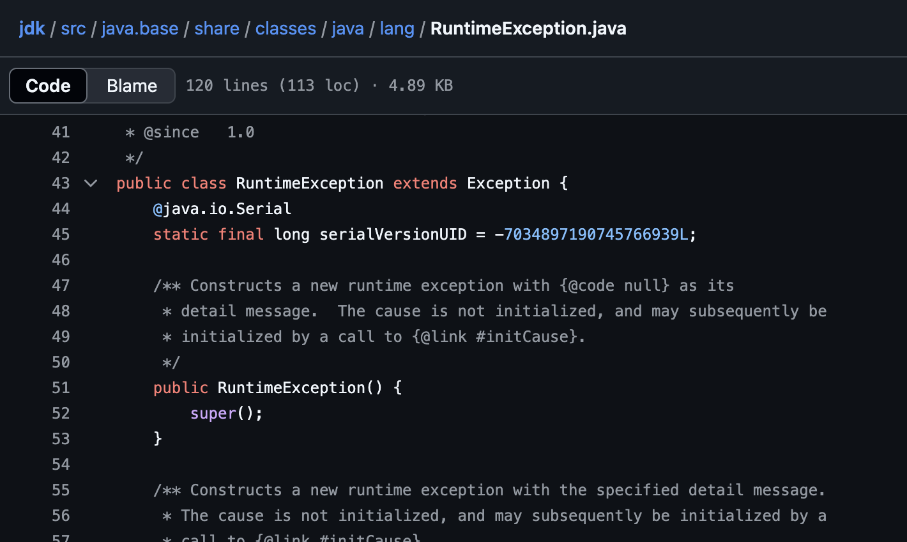
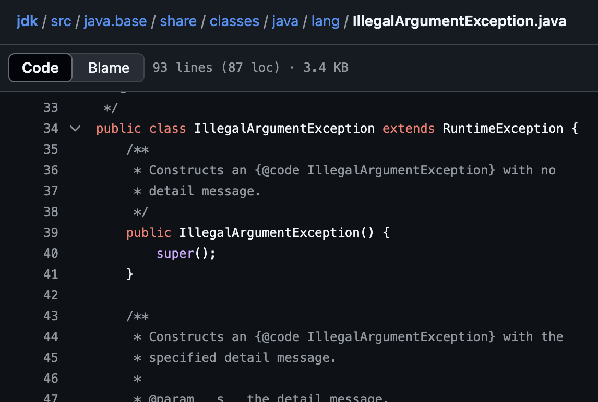

# RuntimeException


## 1. Unchecked Exception 과 RuntimeException

### (1) 모든 Unchecked Exception 은 RuntimeException 의 후손이다.
### (2) RuntimeException 은 프로그래머가 짠 코드의 실수에서 비롯된다.
### (3) 코드의 실수는 코드를 고처서 해결해야하므로 자바가 Exception을 핸들링을 하도록 강요하지 않는다. 
### (4) 프로그램에 RuntimeException 이 있더라도 컴파일은 되지만 코드가 실행될때(Runtime) 다운이 된다.
---

### 자바 클래스 구조


```
Object
│
└── Throwable
    │
    │   (시스템 레벨 에러)
    ├── Error
    │   │    
    │   ├── OutOfMemoryError
    │   └── StackOverflowError
    │
    │   (코드 레벨 이벤트)
    └── Exception
        │
        │   (Unchecked Exception)
        ├── RuntimeException
        │   │
        │   ├── NullPointerException
        │   ├── ArrayIndexOutOfBoundsException
        │   └── (그 외 다수...)
        │
        │  (Checked Exception)
        ├── SQLException             
        ├── ClassNotFoundException   
        ├── IOException
        └── (그 외 다수...)
```

---


#### - RuntimeException 자체가 throw 되는 경우는 거의 없다.
#### - 거의 모든 경우 RuntimeException 의 자손 클래스들이 throw된다.
---

### 많이 throw 되는 RuntimeException 들
1. **NullPointerException**
2. **ArrayIndexOutOfBoundsException**
3. StringIndexOutOfBoundsException
4. IllegalArgumentException
5. NumberFormatException
## 2. RuntimeException 소스코드
### RuntimeException
---


### IllegalArgumentException

